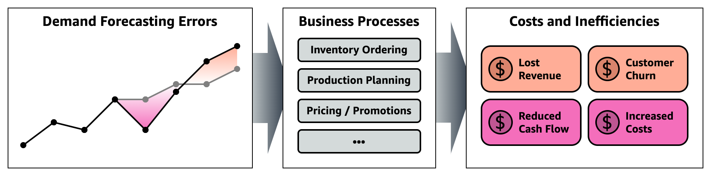

# Measuring Demand Forecasting Benefits

Particularly in retail and manufacturing industries, nearly every business wishes they could forecast future demand for products and materials more accurately - to make better planning decisions and drive important top-level outcomes.

AWS tools like [Amazon Forecast](https://aws.amazon.com/forecast/) and [Amazon SageMaker Canvas](https://catalog.us-east-1.prod.workshops.aws/workshops/80ba0ea5-7cf9-4b8c-9d3f-1cd988b6c071/en-US/3-retail/) help customers build more accurate forecasts using advanced techniques, with no ML expertise required: But it's easy for PoC projects to get bogged down in **accuracy metrics** (like RMSE, MAPE, and MAE) - and lose sight of the **business value** of those accuracy improvements.

For many organizations, it can seem complex and difficult to measure the business value of improved demand forecasts:

1. **Separate teams** often own forecasting versus downstream decisions (like stock ordering, production planning, etc) - so forecasters may lack visibility of the impact of their work.
2. Many organizations are **not ready to fully automate** these downstream decisions - with humans like category or store managers continuing to have oversight of planning. These human factors mean we can't perfectly simulate what *would* have happened if a different forecast had been presented.
3. The **cost of waste** is not always easy to quantify - it depends on factors like whether stock can be re-used in later months, or how many potential sales might have been lost during an out-of-stock period.

...but it's also **highly important** for understanding the overall business case: Because changing or integrating forecast tools (or maintaining and refining existing models) **incurs cost**. We need to understand what strategy is best for the business overall, and which project investments will yield the best returns.

This repository gives some **initial examples** to help you start estimating costs associated with different forecasting errors, and so shift your focus from pure scientific accuracy to actual RoI. You may want to tailor the assumptions to your particular context and data, but even a rough estimate can be a useful guide when developing your business case.

## Getting started

Before you begin, we recommend that you [create and onboard to a SageMaker Studio Domain](https://docs.aws.amazon.com/sagemaker/latest/dg/gs-studio-onboard.html). This requires an AWS Account, and a user with access to create the Domain. You can refer to the pre-requisites [here](https://docs.aws.amazon.com/sagemaker/latest/dg/gs-set-up.html). Once that has been completed, [launch SageMaker Studio](https://docs.aws.amazon.com/sagemaker/latest/dg/studio-launch.html) and open a "System Terminal" from the launcher, from which you can clone this repository: `git clone https://github.com/aws-samples/measuring-demand-forecast-benefits`.

With your SageMaker notebook environment set up, you can work through the notebooks in numbered order to create and then evaluate some forecasts:

- [1.1. Moving Average Baseline.ipynb](1.1.%20Moving%20Average%20Baseline.ipynb): Walk through preparing a simple baseline forecast based on the moving average of recent sales each month.
- **Either or both of:**
    - [1.2. Run SageMaker Canvas.ipynb](1.2.%20Run%20SageMaker%20Canvas.ipynb): Build an advanced ensembling forecast model using [Amazon SageMaker Canvas](https://aws.amazon.com/sagemaker/canvas/), a **no-code** tool optimized for business analysts.
    - [1.3. Run Amazon Forecast.ipynb](1.3.%20Run%20Amazon%20Forecast.ipynb): Build an advanced ensembling forecast model using [Amazon Forecast](https://aws.amazon.com/forecast/), through the AWS SDK for Python.
- [2. Measuring Forecast Benefits.ipynb](2.%20Measuring%20Forecast%20Benefits.ipynb): Estimate and compare business costs incurred by over- and under-forecasting demand, to quantify the real-world benefits of migrating to an ML-powered demand forecast.

## About the dataset

Since published example datasets often include only a small number of features that aren't representative of real-world retail and manufacturing organizations, this sample uses a **synthetic generated dataset** oriented towards clothing retail. The synthetic data spans:

- **Start date:** January 1, 2017
- **End dates:** Actual sales, costs and prices end on December 31, 2019. Weekend and public holiday reference data continues to December 31, 2020 so as to also be available for forecasting period.
- **Features / scope:** 3 stores each in 4 different countries (12 total locations), each selling 8 different product types in 5 sizes and 10 colors (400 total SKUs)

You can find the code used to generate the dataset in the [synthetic_data_generation/](synthetic_data_generation) folder, and customize your own example if you'd like.

To **bring your own business data**, review the data model and customization notes below. The closer you can fit your source data to this schema, the less customization of the analysis will be needed.

### Sample data model

#### **`sales.parquet`** - Product sales (3.1M rows)

Daily sales count by store location and SKU. As standard, records are omitted for zero-sales combinations (where store X did not sell item Y on day Z). Typically sourced from sales system of record.

| Field | Type | Detail |
|------:|:----:|:-------|
| **\*date** | datetime (YYYY-MM-DD) | Date of the record, daily. |
| **sales** | integer | Number of units of this location and SKU, sold on this day. |
| **\*location** | string | Individual location ID, which is equivalent to `{country}_{store}` e.g. `Brazil_Store1`. |
| **\*sku** | string | Specific item Stock Keeping Unit (SKU), which is equivalent to `{product}_{color}_{size}` e.g. `Hoodie_gray_L`. |

Fields marked '\*' combine for a unique composite key with no duplicates.

#### **`metadata.csv`** - Static product metadata (400 rows)

Metadata about each individual product/SKU that does *not change over time*. Sometimes referred to as an "item master" in retail contexts.

| Field | Type | Detail |
|------:|:----:|:-------|
| **product** | string | Functional type of the product e.g. `Gloves` or `T-Shirt`. |
| **item_size** | string | Size variant (`XS` to `XL`). |
| **color** | string | Color variant (e.g. `brown`, `gray`). |
| **\*sku** | string | Specific item Stock Keeping Unit (SKU), which is equivalent to `{product}_{color}_{size}` e.g. `Hoodie_gray_L`. |

`sku` field is a unique key with no duplicates and full coverage of the products featured in `sales.parquet`.

#### **`weekend_holiday_flag.csv`** - Per-country working day data (5,884 rows)

Record for every calendar day covered by the dataset, whether it was a working day, weekend, or public holiday - in each country.

> ℹ️ **Tip:** This reference data has been prepared as a potential input to improve forecast quality, but users of Amazon Forecast / Amazon SageMaker Canvas should consider the [built-in holidays featurization](https://docs.aws.amazon.com/forecast/latest/dg/holidays.html) instead! Just check if your operating country/ies are supported.

| Field | Type | Detail |
|------:|:----:|:-------|
| **\*country** | string | Name of the operating country. |
| **\*date** | string (YYYY-MM-DD) | Date of the record, daily with no gaps. |
| **weekend_hol_flag** | integer | 0 if the day is a normal working day in this country. 1 if a regular weekend. 2 if a designated public holiday. |

Fields marked '\*' combine for a unique composite key with no duplicates and no gaps.

#### **`prices_promos.parquet`** - Product sale prices and promotions (35k rows)

The offered per-unit sale price (to customers) for products over the historical period.

> ⚠️ **Note:** It's best to take offered price data from a dedicated system of record for pricing and promotions, if you can. Although sales data systems do typically include actual price paid per transaction after promotions, it can be challenging to input to a forecasting model: You'd need to fill in historical gaps (where product A was not sold at all on a particular day) and may have a harder time projecting out planned prices during the forecasting period (an important input to the forecast).
>
> In this example, model a separate system of record that keeps track of how each item is priced over time, and when promotional discounts were applied.

| Field | Type | Detail |
|------:|:----:|:-------|
| **\*date** | datetime (YYYY-MM-DD) | Date of the record, daily with no gaps. |
| **\*country** | string | Name of the operating country. |
| **\*product** | string | Name of the product type (e.g. `Gloves`). |
| **promo** | float | Discount factor from standard price where a promotion was applied: Usually `1.0` (no discount), would be `0.8` for a 20% off deal, and so on. |
| **unit_price** | float | Price per item as offered for sale to customers *after* applying `promo` discount. |

Fields marked '\*' combine for a unique composite key with no duplicates and no gaps.

At the time of writing we have no strong view on whether {promo, price-after-promo} or {promo, price-before-promo} would be a better pair of input features for forecast model accuracy... But used price-after-promo in the data model to reduce the chance of retrospective benefits analyses accidentally omitting discounts when estimating lost sales revenue.

#### **`unit_costs.parquet`** - Product unit costs for procurement/manufacture (1,152 rows)

The procurement cost (from suppliers, or in-house manufacture) per-unit for products over the historical period.

In practice, for many businesses this may be driven by quotes from suppliers and there may be no visibility on what prices could have been available on days/periods where no inventory order was made. There may also be volume discounts depending on the size of each order - the structure of which might be openly advertised or hidden and changeable.

In this sample, we don't currently model procurement volume discounts or try to optimize timing of purchase orders for price versus storage costs. All we need is some approximation of the procurement cost per unit for each forecasting period.

| Field | Type | Detail |
|------:|:----:|:-------|
| **\*country** | string | Name of the operating country. |
| **\*product** | string | Name of the product type (e.g. `Gloves`). |
| **\*date** | string (YYYY-MM) | Procurement month, monthly with no gaps. |
| **unit_cost** | float | Cost per item incurred by the business for procurement/manufacture, distribution, etc. |

Fields marked '\*' combine for a unique composite key with no duplicates and no gaps.

### Notes for custom data sets

If your business data doesn't exactly match the sample dataset schema, what differences will be easier or harder to accommodate? We can't answer every possible scenario, but here are some useful tips:

- **Format and access:** This sample mainly uses **Python notebooks** and [Pandas](https://pandas.pydata.org/) to load and transform the source data before analysis or feeding to other services like Amazon Forecast.
    - CSV (through `pandas.read_csv()`), Parquet (through `pandas.read_parquet()`) and even other formats [supported by pandas IO](https://pandas.pydata.org/docs/reference/io.html) should be fine, so long as any datasets prepared for Amazon Forecast meet [Forecast's own requirements](https://docs.aws.amazon.com/forecast/latest/dg/howitworks-datasets-groups.html).
- **Pivoted tables and "horizontal" spreadsheets:** If your existing forecast or data is in a 2D format (most commonly, with separate columns for each month), you'll need to "unpivot" it into a *flat file* with one column for the values and a separate column tagging each row to a date/period. For example, as shown in [pandas.DataFrame.stack()](https://pandas.pydata.org/docs/reference/api/pandas.DataFrame.stack.html#pandas.DataFrame.stack).
- **Breakout "dimensions":** Amazon Forecast and SageMaker Canvas forecasting both build "multi-item" models which *must* have at least one `item_id` dimension (for which we use product SKU, but you could put a dummy if you really do only have one thing to forecast). You *can* have other, possibly multiple, breakout dimensions: We use `location`, but you could consider for example separating `store` and `country` fields.
- **Different periods and forecast horizons:** As shown in this sample, the frequency of the forecasting model(s) and analysis do not need to match: we build a 31-day daily forecasting model with Amazon forecast, a monthly rolling average baseline, and analyze results at the monthly level). Depending on your data, you might find that either training a low-frequency model (e.g. monthly) and using it direct, or training a high-frequency model (e.g. daily) and aggregating results could perform best. Just be aware that aggregation is a one-way street and needs to be aligned with your business processes: Since one of our forecasts is monthly, we can't compare results at a daily level and must assume that e.g. inventory procurement is also on a monthly cycle.

## Security

See [CONTRIBUTING](CONTRIBUTING.md#security-issue-notifications) for more information.

## License

This library is licensed under the MIT-0 License. See the LICENSE file.
